# SSM Simulations

SSM (Sierra Solid Mechanics) Simulations workflow is a parallel pathway to the
ABAQUS Simulations pathway.  Both pathways then converge at the Postprocessing
step in the workflow.

## Start Point: Medical Images

* Repo: https://github.com/autotwin/pixel
* T1 Utah SCI data set, images for 600+ subjects, for example 8 subjects shown below:

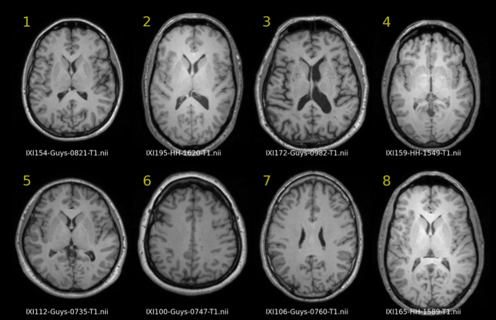

## Previous: Isosurface

* Two material: brain and non-brain
* Repo: https://github.com/autotwin/pixel

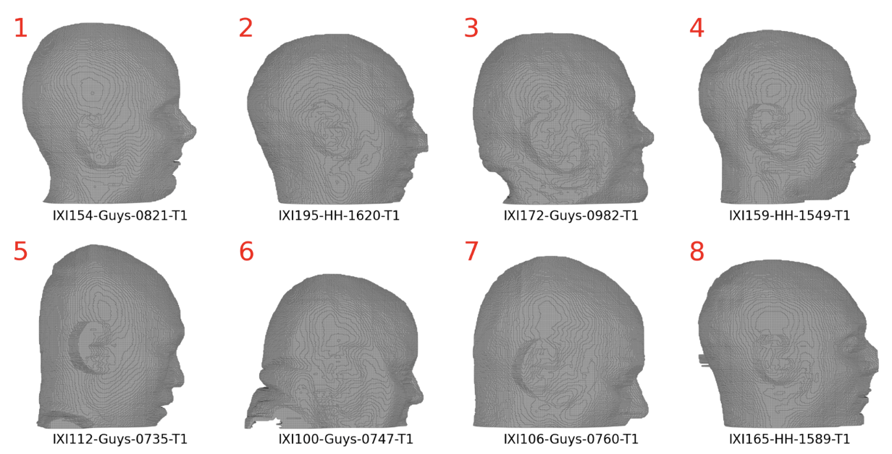

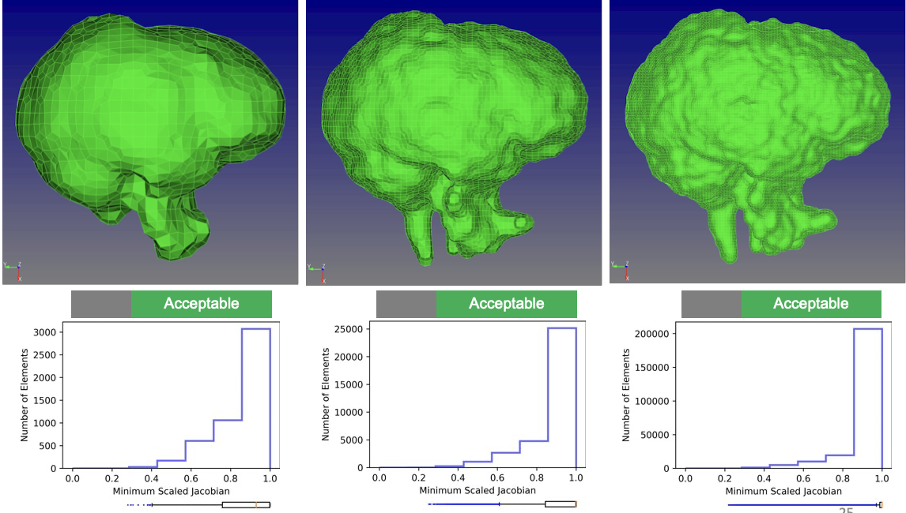

* Repo: https://github.com/autotwin/pitch-deck?tab=readme-ov-file#2023-06-26-onr-annual-review
* End Point
  * Poor Element Quality
  * Non-Automated Repair
  * Not extensible for three or more materials
    * Sliver elements
  * Closed-source (Sculpt)

## Current: Segmentation

* Repo: https://github.com/autotwin/ensemble

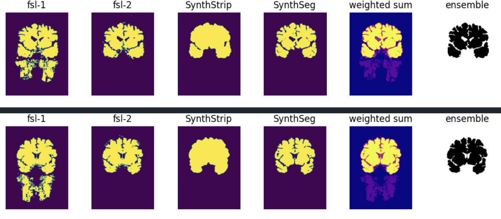

* Repo: https://github.com/autotwin/mesh/blob/main/doc/npy_to_mesh_part_3.md
* IXI012-HH-1211-T1_medium.npy (614 kB)
* IXI012-HH-1211-T1_large.npy (4.3 MB)

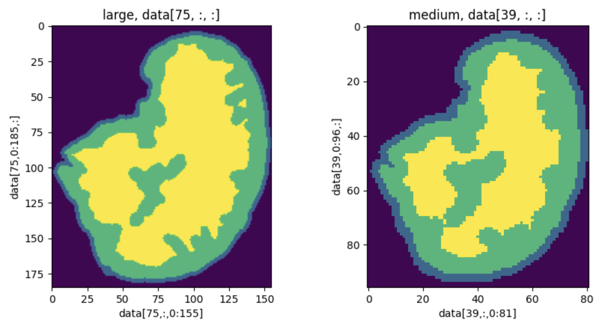

### Segmentation (SPN) to Mesh via Sculpt

* Repo: https://github.com/autotwin/mesh/blob/main/doc/npy_to_mesh_part_3.md

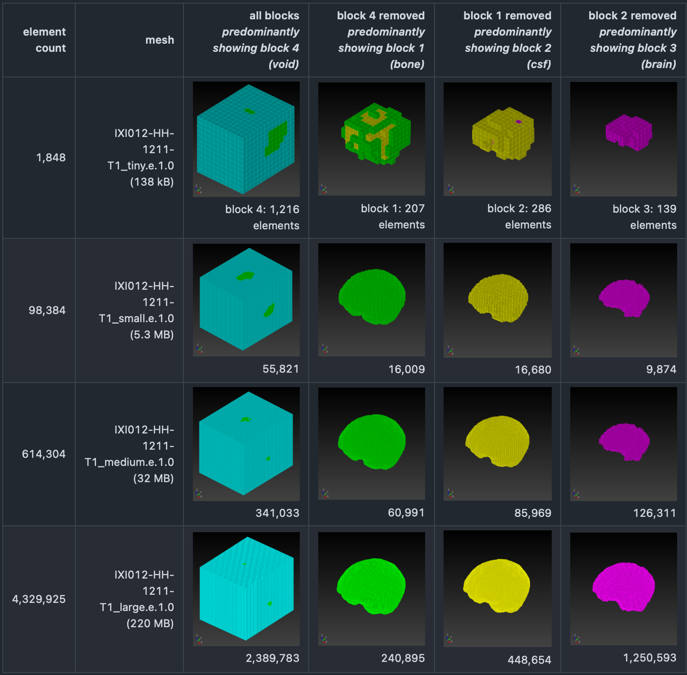

* Repo: https://github.com/autotwin/ssm
* `npy_to_mesh.py` with manual invention, suppress void

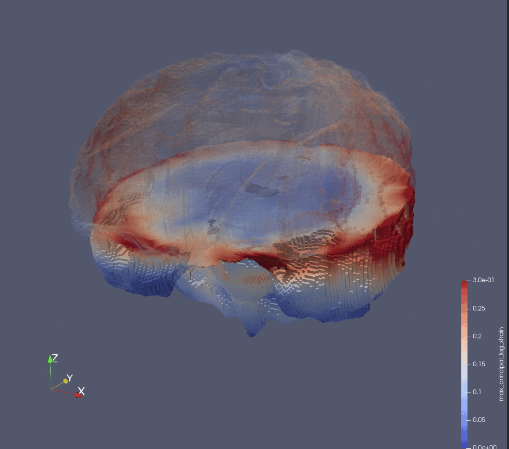

* Disadvantages:
  * Closed-source
  * New capability requests can be very challenging
  * Requires void inclusion
    * Bloats file size
    * Complicates SSM input deck (suppress block commands)
  * No hierarchical smoothing
  * No Taubin smoothing (only Laplace smoothing)
    * Laplace smoothing is not volume-preserving (isochoric)

## Next Point: Mesh via `autotwin`

We create a folder at [OneDrive/scratch/ixi](https://1drv.ms/f/c/3cc1bee5e2795295/Et9W9UNhD51KnhfjpWm8lvwBzF2q5-22-kdbkfc_TMKExQ?e=oAbF6a)

From that folder, we select the segmentation
`IXI012-HH-1211-T1_large.npy` (4.3 MB),
for processing, downloading it to the local `~/scratch/ixi` folder.

### Determine the geometric center

We determine the geometric center of the assembly.

Using a Test Driven Design (TDD) approach, we create a unit test,
[`test_center_of_gravity.py`](test_center_of_geometry.py), using the
[`letter_f`](https://autotwin.github.io/automesh/examples/unit_tests/index.html#letter-f)
example:

```sh
cp ~/autotwin/automesh/tests/input/letter_f.spn ~/autotwin/autosim/ssm/.
am convert segmentation -i letter_f.spn -o letter_f.npy -x 3 -y 5 -z 1
am mesh hex -i letter_f.npy -o letter_f.inp
```

The `letter_f.npy` has the form:

```python
array([[[11],
        [11],
        [11],
        [11],
        [11]],

       [[ 0],
        [ 0],
        [11],
        [ 0],
        [11]],

       [[ 0],
        [ 0],
        [ 0],
        [ 0],
        [11]]], dtype=uint8)
```

because NumPy saves this array in `(z, y, x)` order.

Visualize `letter_f.inp` in Cubit:

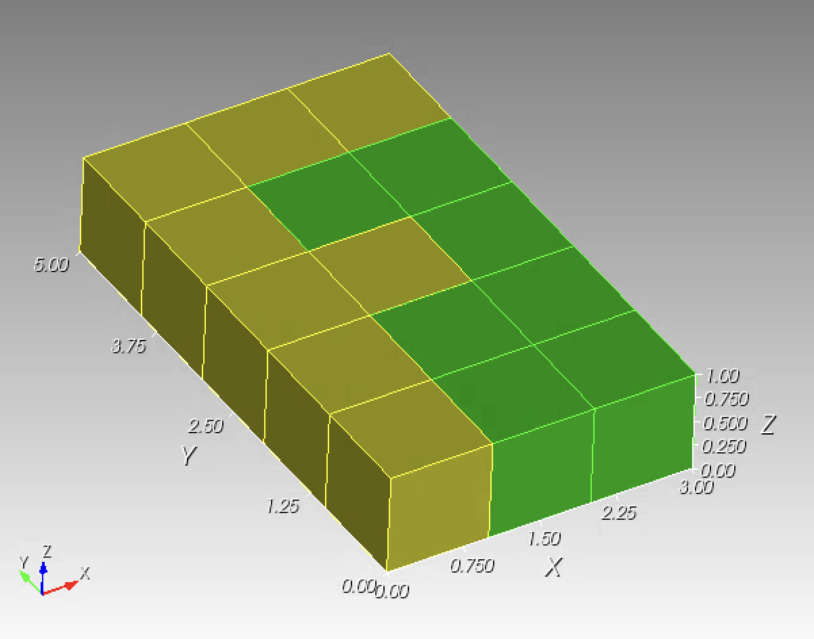

where

* green is `Volume 1` with center of geometry
  * `x = 2.071429`
  * `y = 1.928571`
  * `z = 0.500000`
* yellow is `Volume 2` with center of geometry
  * `x = 1.000000`
  * `y = 3.000000`
  * `z = 0.500000`
* the assembly (`Volume 1` + `Volume 2`) has center of geometry
  * `x = 1.500000`
  * `y = 2.500000`
  * `z = 0.500000`

We will use these above-shown values as a fiducial for tests to develop
[`center_of_geometry.py`](center_of_geometry.py).

The geometric center for each segmentation file is used as the offset value
for the `autotwin mesh hex` command.

The meshes are made with [`segmentation_to_mesh.py`](segmentation_to_mesh.py).

> Remark: The `segmentation_to_mesh.py` workflow depends on a installation of `automesh`.  See these [installation instructions](https://autotwin.github.io/automesh/installation.html).

Below are three meshes, translated to their center, but not scaled (thus length units are in voxels), created with `segmentation_to_mesh.py`:

`IXI012-HH-1211-T1_small.png` | `IXI012-HH-1211-T1_medium.png` | `IXI012-HH-1211-T1_large.png`
:---: | :---: | :---:
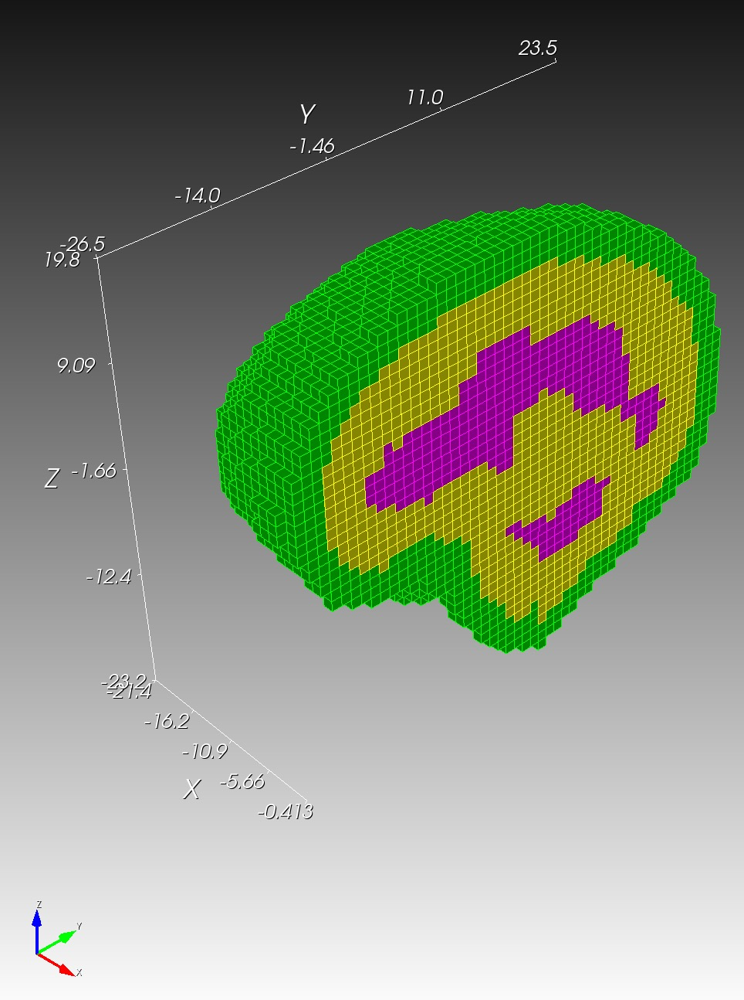 | 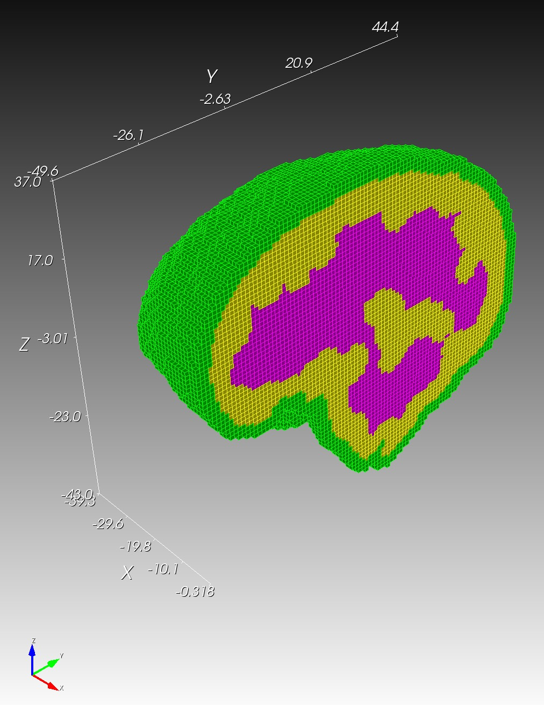 | 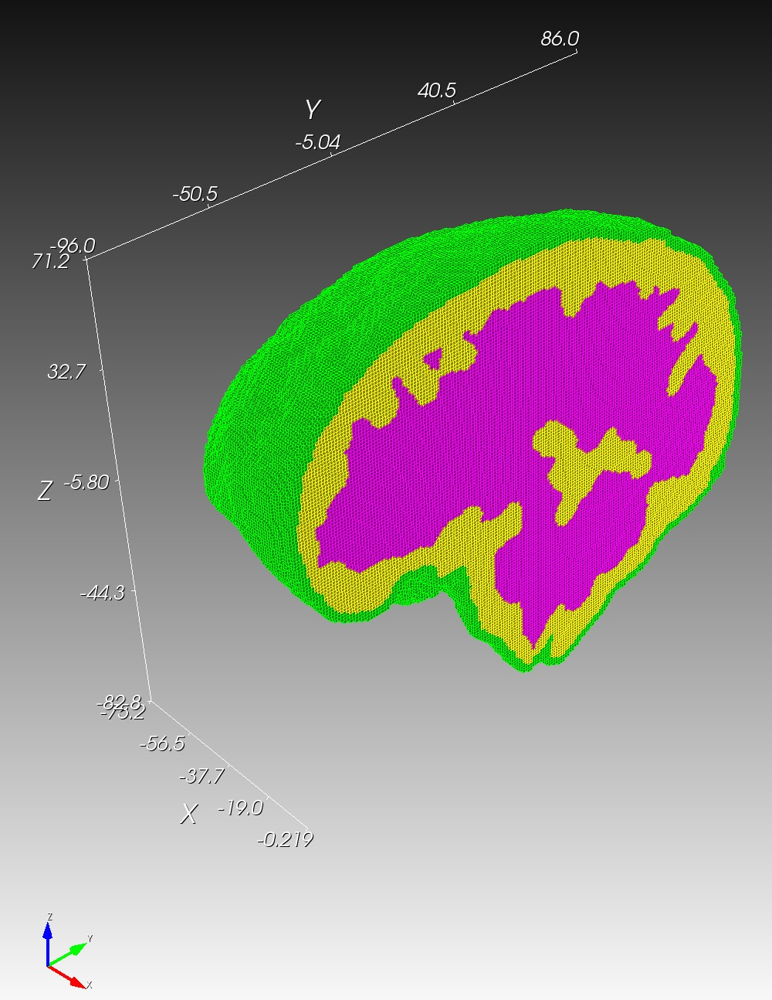
[`IXI012-HH-1211-T1_small.inp`](https://1drv.ms/u/c/3cc1bee5e2795295/EVd-rG0kkEBFmKSF8JvtnxkBHNSAFDcFrlF_EnurBBi_Ww?e=xgGl8R) | [`IXI012-HH-1211-T1_medium.inp`](https://1drv.ms/u/c/3cc1bee5e2795295/EXBHE63J6HtCglYbUx6BVWoBUqlbX4pEBDRZKThESzKcxA?e=yWQhLz) | [`IXI012-HH-1211-T1_large.inp`](https://1drv.ms/u/c/3cc1bee5e2795295/EZ-HSHXauRVFtfwAMaXCMVoBccC1eyQ-o7v-m-QTD43Hvw?e=wyoNUv)

## Simulation

Move the output `.exo` meshes to the HPC, command+K

```sh
~/autotwin/ssm/geometry/ixi
  IXI012-HH-1211-T1_small
    IXI012-HH-1211-T1_small.exo
  IXI012-HH-1211-T1_medium
    IXI012-HH-1211-T1_medium.exo
  IXI012-HH-1211-T1_large
    IXI012-HH-1211-T1_large.exo
```

Copy the seeded `submit_script` used for mesh decomposition:

```sh
cp ~/autotwin/ssm/geometry/submit_script ~/autotwin/ssm/geometry/ixi/IXI012-HH-1211-T1_small/
```

### Mesh Decomposition

Update the [`submit_script`](https://github.com/autotwin/ssm/blob/main/geometry/ixi/IXI012-HH-1211-T1_small/submit_script) as follows:

```sh
#!/bin/bash

module purge
module load sierra
module load seacas

# previously ran with 16 processors
# PROCS=16
# 10 nodes = 160 processors
PROCS=160
# PROCS=320
# PROCS=336

# geometry and mesh file
# GFILE="../geometry/bob-1mm-5kg-helmet2-hemi.g"
# GFILE="/projects/sibl/data/bob-1mm-5kg-helmet-hemi/bob-1mm-5kg-helmet2-hemi.g"
# GFILE="/projects/sibl/data/bob-1mm-5kg-helmet-hemi/bob-1mm-5kg-helmet2-hemi.g"
# GFILE="../../geometry/bob-1mm-5kg-helmet2-hemi.g"
# GFILE="bob-1mm-5kg-helmet2-hemi.g"
# GFILE="sphere/sr2/spheres_resolution_2.exo"
GFILE="IXI012-HH-1211-T1_small.exo"

decomp --processors $PROCS $GFILE

# short can be used for nodes <= 40 and wall time <= 4:00:00 (4 hours)
```

Run the script to decompose the mesh:

```sh
./submit_script
```

Verify that the mesh file is decomposed into `160` domains:

```sh
ls
-rw------- 1 chovey chovey   38260 May 23 14:21 IXI012-HH-1211-T1_small.exo.160.000
...
-rw------- 1 chovey chovey   37988 May 23 14:22 IXI012-HH-1211-T1_small.exo.160.159
```

### Input File

Create the input file from a seeded working input file:

```sh
mkdir ~/autotwin/ssm/input/IXI012-HH-1211-T1_small
cp ~/autotwin/ssm/input/sr4c/sr4c.i ~/autotwin/ssm/input/IXI012-HH-1211-T1_small/ssm_input.i
```


Copy seeded submit scripts:

```sh
cd ~/autotwin/ssm/input/sr4c
cp submit_check ../IXI012-HH-1211-T1_small/.
cp submit_clean ../IXI012-HH-1211-T1_small/.
cp submit_script ../IXI012-HH-1211-T1_small/.
```

Update the `submit` scripts:

```sh
cd ../IXI012-HH-1211-T1_small/
```

* Update [`submit_check`](https://github.com/autotwin/ssm/blob/main/input/IXI012-HH-1211-T1_small/submit_check).
* The [`submit_clean`](https://github.com/autotwin/ssm/blob/main/input/IXI012-HH-1211-T1_small/submit_clean) reqires no modification.
* Update [`submit_script`](https://github.com/autotwin/ssm/blob/main/input/IXI012-HH-1211-T1_small/submit_script).
* Update [`ssm_input.i`](https://github.com/autotwin/ssm/blob/main/input/IXI012-HH-1211-T1_small/ssm_input.i).

### Queue Reference

```sh
mywcid
sinfo
squeue -u chovey
squeue -u chovey --start

# .bash_profile alias shortcuts
alias sq="squeue -u chovey"
alias ss="squeue -u chovey --start"
```

### Simulation Matrix

Continuing from simulations `1..7` on [ssm](https://github.com/autotwin/ssm?tab=readme-ov-file#mesh-characteristics)

item | `sim` | # elements | bc (ms, krad/s) | T_sim (ms) | machine | # proc | cpu time (hh:mm)
:---: | :---: | ---: | ---: | ---: | :---: | ---: | ---: |
8 | `IXI012-HH-1211-T1_small` | 42,567 | 8, 8 | 20 | attaway | 160 | <1 min
9 | `IXI012-HH-1211-T1_medium` | 273,278 | 8, 8 | 20 | attaway | 160 | 00:03
10 | `IXI012-HH-1211-T1_large` | 1,940,140 | 8, 8 | 20 | attaway | 160 | 09:35

## Post-processing

* ParaView 5.12.0 on macOS (local)
* File | Connect...
* ghost (viz nodes)
  * seems not to work
  * Plan B: copy .exo results files to local (only about 190 MB, tractable for now)
* File | Open...
* Clip plane at (0, 0, 0) in direction (0, 0, 1)
* Opacity top hemisphere at 0.05.

### Left Hook


Excerpt from [Boxing Stars](https://youtu.be/AbX575YegkM?si=rpbexI9316m8i7pE).  Converted with [Ezgif](https://ezgif.com/).

### Brain Strain

Create movie with [Exgif](https://ezgif.com/maker)

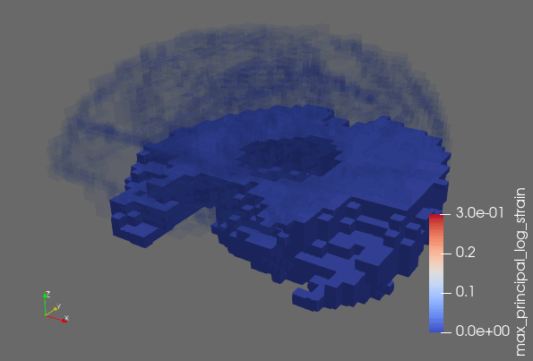
