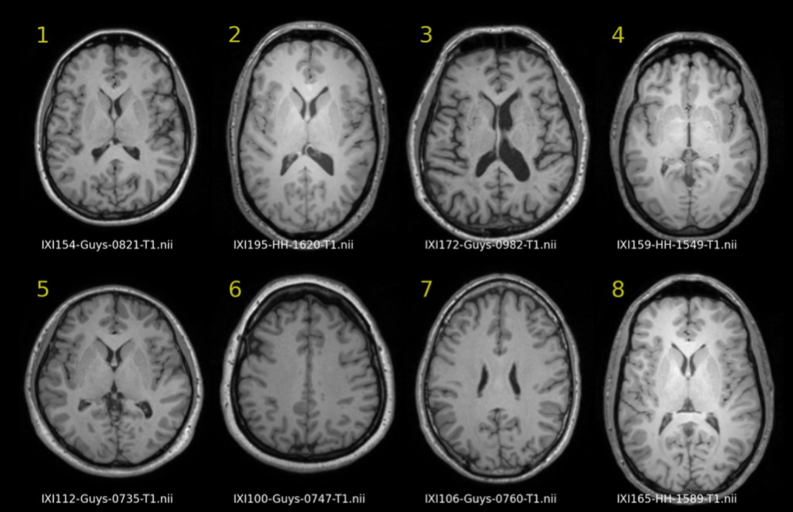
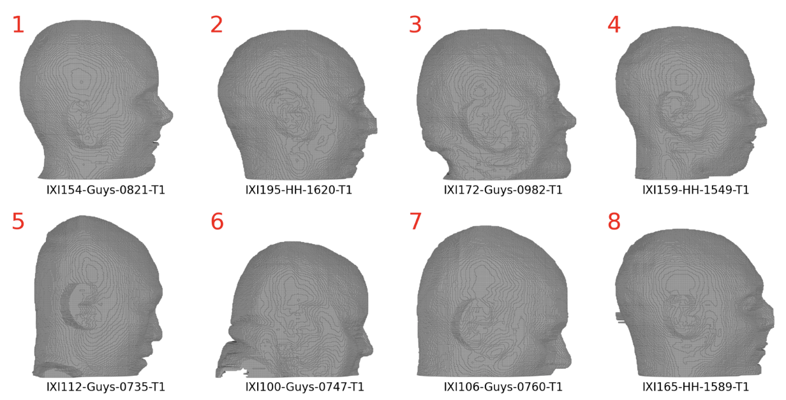
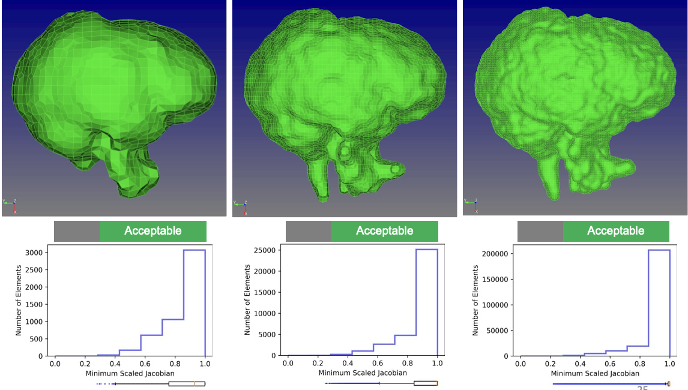
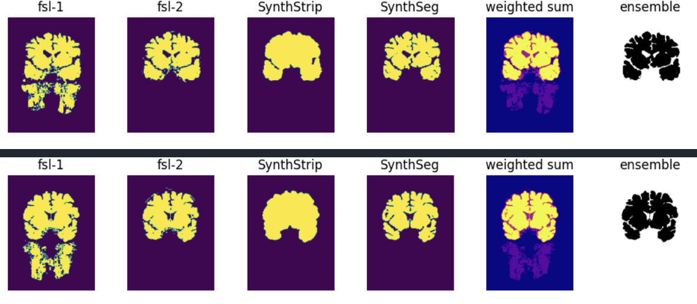
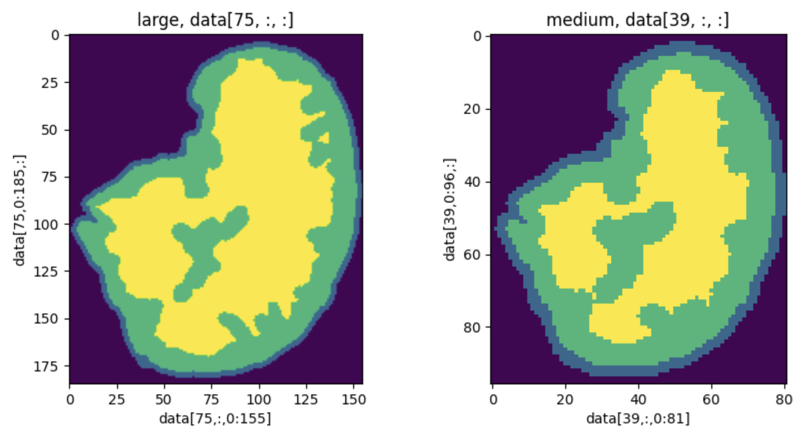
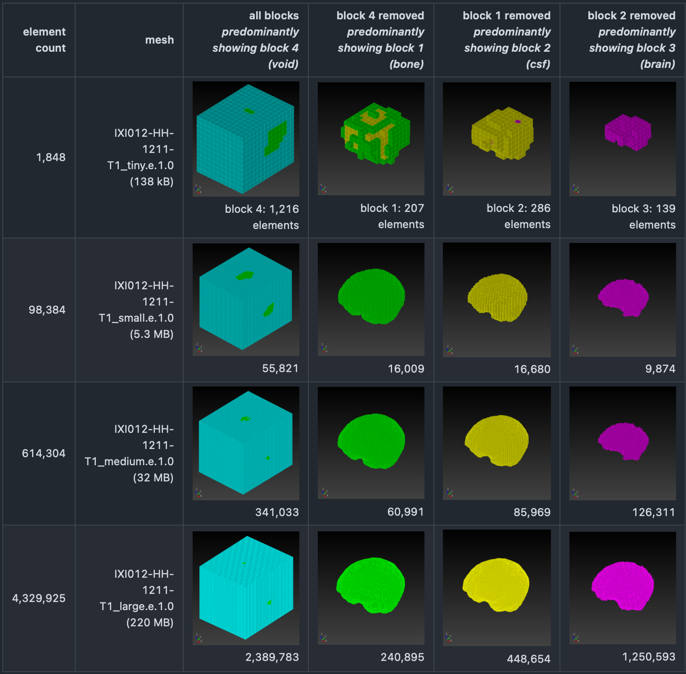
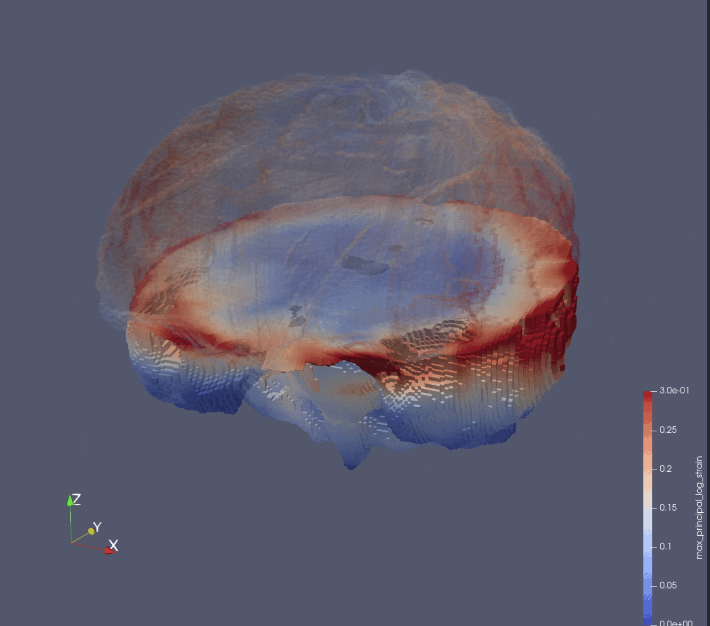

# SSM Simulations

SSM (Sierra Solid Mechanics) Simulations workflow is a parallel pathway to the
ABAQUS Simulations pathway.  Both pathways then converge at the Postprocessing
step in the workflow.

## Start Point: Medical Images

* Repo: https://github.com/autotwin/pixel
* T1 Utah SCI data set, images for 600+ subjects, for example 8 subjects shown below:

## Previous: Isosurface

* Two material: brain and non-brain
* Repo: https://github.com/autotwin/pixel

* Repo: https://github.com/autotwin/pitch-deck?tab=readme-ov-file#2023-06-26-onr-annual-review
* End Point
  * Poor Element Quality
  * Non-Automated Repair
  * Not extensible for three or more materials
    * Sliver elements

## Current: Segmentation

* Repo: https://github.com/autotwin/ensemble

* Repo: https://github.com/autotwin/mesh/blob/main/doc/npy_to_mesh_part_3.md
* IXI012-HH-1211-T1_medium.npy (614 kB)
* IXI012-HH-1211-T1_large.npy (4.3 MB)

### Segmentation (SPN) to Mesh via Sculpt

* Repo: https://github.com/autotwin/mesh/blob/main/doc/npy_to_mesh_part_3.md

* Repo: https://github.com/autotwin/ssm
* `npy_to_mesh.py` with manual invention, suppress void

* Disadvantages:
  * Closed-source
  * Slow-to-never responses to request for new capability
  * Requires void inclusion
    * Bloats file size
    * Complicates SSM input deck (suppress block commands)
  * No hierarchical smoothing
  * No Taubin smoothing (only Laplace smoothing)
    * Laplace smoothing is not not volume-preserving (isochoric)

## Next Point: Mesh via `autotwin`

To come.

## Next Point: Simulation

To come.

## Next Point: Post-processing

To come.