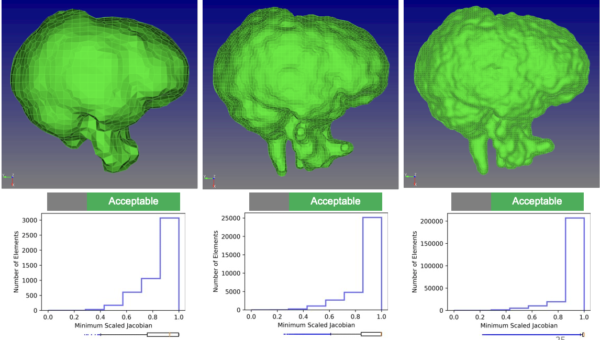
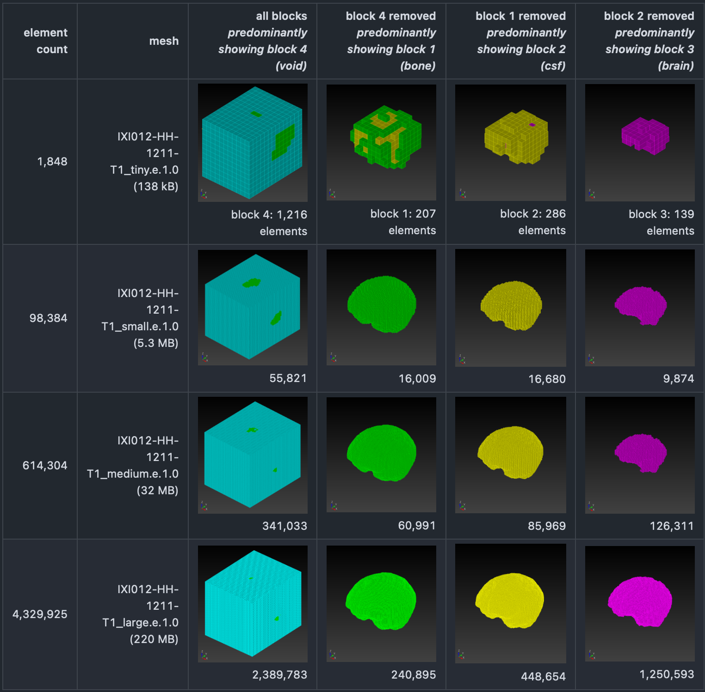
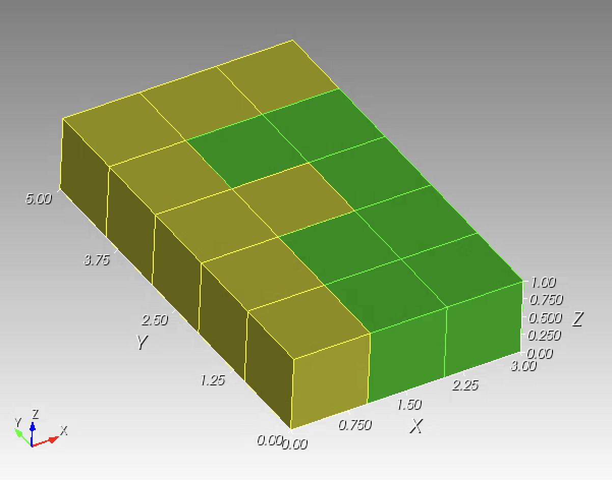

# SSM Simulations

SSM (Sierra Solid Mechanics) Simulations workflow is a parallel pathway to the
ABAQUS Simulations pathway.  Both pathways then converge at the Postprocessing
step in the workflow.

## Start Point: Medical Images

* Repo: https://github.com/autotwin/pixel
* T1 Utah SCI data set, images for 600+ subjects, for example 8 subjects shown below:


## Previous: Isosurface

* Two material: brain and non-brain
* Repo: https://github.com/autotwin/pixel




* Repo: https://github.com/autotwin/pitch-deck?tab=readme-ov-file#2023-06-26-onr-annual-review
* End Point
  * Poor Element Quality
  * Non-Automated Repair
  * Not extensible for three or more materials
    * Sliver elements
  * Closed-source (Sculpt)

## Current: Segmentation

* Repo: https://github.com/autotwin/ensemble


* Repo: https://github.com/autotwin/mesh/blob/main/doc/npy_to_mesh_part_3.md
* IXI012-HH-1211-T1_medium.npy (614 kB)
* IXI012-HH-1211-T1_large.npy (4.3 MB)


### Segmentation (SPN) to Mesh via Sculpt

* Repo: https://github.com/autotwin/mesh/blob/main/doc/npy_to_mesh_part_3.md



* Repo: https://github.com/autotwin/ssm
* `npy_to_mesh.py` with manual invention, suppress void


* Disadvantages:
  * Closed-source
  * Slow-to-never responses to request for new capability
  * Requires void inclusion
    * Bloats file size
    * Complicates SSM input deck (suppress block commands)
  * No hierarchical smoothing
  * No Taubin smoothing (only Laplace smoothing)
    * Laplace smoothing is not volume-preserving (isochoric)

## Next Point: Mesh via `autotwin`

We create a folder at [OneDrive/scratch/ixi](https://1drv.ms/f/c/3cc1bee5e2795295/Et9W9UNhD51KnhfjpWm8lvwBzF2q5-22-kdbkfc_TMKExQ?e=oAbF6a)

From that folder, we select the segmentation
`IXI012-HH-1211-T1_large.npy` (4.3 MB),
for processing, downloading it to the local `~/scratch/ixi` folder.

### Determine the geometric center

We determine the geometric center of the assembly.

Using a Test Driven Design (TDD) approach, we create a unit test,
[`test_center_of_gravity.py`](test_center_of_geometry.py), using the
[`letter_f`](https://autotwin.github.io/automesh/examples/unit_tests/index.html#letter-f)
example:

```sh
cp ~/autotwin/automesh/tests/input/letter_f.spn ~/autotwin/autosim/ssm/.
am convert segmentation -i letter_f.spn -o letter_f.npy -x 3 -y 5 -z 1
am mesh hex -i letter_f.npy -o letter_f.inp
```

The `letter_f.npy` has the form:

```python
array([[[11],
        [11],
        [11],
        [11],
        [11]],

       [[ 0],
        [ 0],
        [11],
        [ 0],
        [11]],

       [[ 0],
        [ 0],
        [ 0],
        [ 0],
        [11]]], dtype=uint8)
```

because NumPy saves this array in `(z, y, x)` order.

Visualize `letter_f.inp` in Cubit:



where

* green is `Volume 1` with center of geometry
  * `x = 2.071429`
  * `y = 1.928571`
  * `z = 0.500000`
* yellow is `Volume 2` with center of geometry
  * `x = 1.000000`
  * `y = 3.000000`
  * `z = 0.500000`
* the assembly (`Volume 1` + `Volume 2`) has center of geometry
  * `x = 1.500000`
  * `y = 2.500000`
  * `z = 0.500000`

We will use these above-shown values as a fiducial for tests to develop
[`center_of_geometry.py`](center_of_geometry.py).

The geometric center for each segmentation file is used as the offset value
for the `autotwin mesh hex` command.

```sh
automesh mesh hex ... (to come)
```

## Next Point: Simulation

To come.

## Next Point: Post-processing

To come.